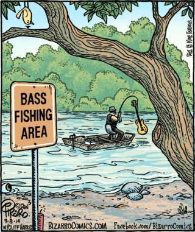
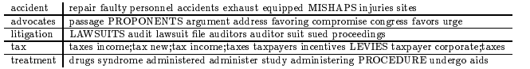
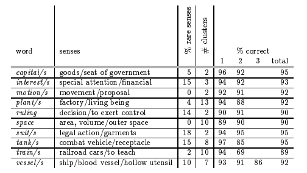
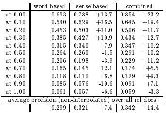
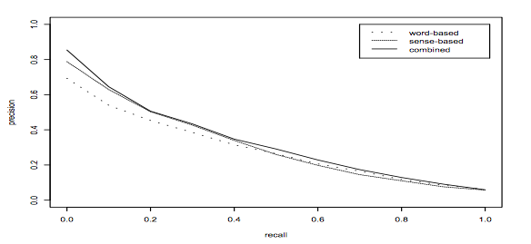
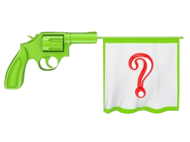

class: center, middle
#Information Retrieval Based on Word Sense
##[Paper](http://citeseerx.ist.psu.edu/viewdoc/download;jsessionid=C25DC884B43E47B0EE70C380AB7DB550?doi=10.1.1.33.6617&rep=rep1&type=pdf) by Hinrich Schütze & Jan O. Pedersen

###Presented by 
###Shaughn Finnerty & Neil Warnock

[shaughn.net/pres-word-sense](http://shaughn.net/pres-word-sense)

---

class: center, middle

http://arnoldzwicky.org

---

background-color: transparent;

#Roadmap
- Word sense and it's role in ambiguity

- Word sense in a standard IR system

- Existing approaches to automatic word sense disambiguation

- New approach: **constructing a thesaurus from the existing corpus for word sense disambiguation**
	- Use a vector representation for word similarity derived from lexical co-occurrence in the corpus text to create clusters that represent unique senses of a word
	
- Performance of this algorithm in an IR system 

---

#Introduction - Word Sense
- Ambiguous term: **a word with multiple senses, where a sense is a group of similar usages of a word dissimilar from other usages**
	
	- homographs 
		- words sharing the same written form but having different meaning
		- "river bank" vs. "Bank of New York"
		
	- graded sense
		 - words sharing the same written form and general meaning but having different meaning depending on context
		- "line space" vs. "office space" vs. "exhibition space"

---

#Introduction - Determining Word Sense

- What do we use to determine the sense of a word?

	- syntactic role
		- functional relationship between the word and other words in a clause
		
	- nearby words
		- provide cues and context for the words
		
	- semantics
		- our own general understanding of the meaning
		
- Without **context**, it is impossible to determine sense

---

#Introduction - Ambiguous Terms in IR

- In the bag of words approach, each word is treated as a separate isolated feature
	- **Context is not preserved**
	- Disambiguating word sense is not explicitly achieved
	
-  *However*, since retrievals rarely depend on a single term, it is often the case that implicit disambiguation of a word sense is achieved
	- Documents are retrieved by matching many of the query terms
	
-  Nonetheless, **word sense disambiguation algorithms** should help
	- Should not decrease performance of a standard IR
	- Should increase performance on shorter queries that will provide less opportunity for implicit disambiguation

???

- Bag of words vectors do not contain information on context
- asd

---

#Existing Approaches

- Hand constructed disambiguation rules & hand labeled training 

	- Providing the system with pre-defined sets of rules or training data to disambiguate words with multiple senses

- WordNet Thesaurus
	- Synonym sets are used to construct *classes* that identify a particular sense
	- If many words from a particular class `\(c\)` occur near a word `\(w\)`, then `\(w\)` is disambiguated as belong to the sense associated with `\(c\)`

- Pseudowords
	- Assigning two or more types of words to a new type
	- "banana" & "door" to "banana-door"
	- Adds additional context to terms for evaluations in which pseudo-words are used as query terms
	

???

- Syntactic and semantic structure in a connectionist set
- Online dictionaries
- Constructed knowledge bases

- WordNet:
	- 

- Pseudoword:
	- adds additional context by creating a new word type
	- evaluations use only this pseudoword and thus,

---

#Existing Approaches - WordNet Thesaurus

- Start with the Wordnet online thesaurus

- Create a mapping which maps words into hoods (classes of words)

- If words from a hood appear with an ambiguous word, the ambiguous word has the sense that matches that hood.

##Problems: 
- What if the neighbours are not in the same hood as the ambiguous word?

- WordNet coverage is chosen to be extremely general

- Not fine-tuned enough for domain-specific disambiguation

---
#Existing Approaches - Common Problems

- Lots of resources are needed to create hand constructed disambiguation rules and hand labeled training sets

- **Lack of coverage**

	 - Specialized domains have corpus text containing rare words with specialized meaning that is not covered by generic lexical resources
	 - Cost of customizing the resources to accomodate specialized domains is high

- Psueudowords can be detrimental if they conflate two words that are optimal discriminators in determining relevant documents on their own

???

- Lack of coverage is a problem across all existing solutions
- The algorithm that is presented in this paper seeks to address these problems of lack of coverage and lack of resources available to create hand constructed rules

`\(w_i\)`

<!-- ---

#Wordnet Thesaurus
- WordNet:  It groups English words into sets of synonyms called synsets
	- Transformed into a mapping from words to one or more classes
	 -->

---
	
#Novel Approach - Overview

- Schütze and Pedersen present a two part solution that addresses the issues of lack of coverage, lack of resources available to create hand constructed rules
	- Without losing discriminating power that single terms may provide

1. Create a lexical co-occurrence based thesaurus
	- Associate each term in the corpus with a vector that represents its pattern of local co-occurences
	
2. Characterize the occurrence of a word by summing thesaurus vectors of the words around it
	- Creates a context vector that can be compared for similarity to other context vectors so that a sense of the word can be deduced

???

- Creating a thesaurus based on the text of the corpus allows for specialized terms to be included
- No hand-construction is required to compute the thesaurus, it is automatic

- Assumptions:
	- each occurence of a word has only one sense
	- each word has a fixed number of senses

---

# Novel Approach - Thesaurus Construction

- Create a symettric term-by-term matrix `\(C\)` such that the element `\(c_{ij}\)` records the number of times that words `\(i\)` and `\(j\)` co-occur in a given symettric window of size `\(k\)`
	- `\(k=41\)` in the experiment
	
- **Idea: Words with similar meanings will occur with similar neighbours**

- Topical or semantic similarity between two words can be defined as the cosine between corresponding rows in `\(C\)`

---

name: thesaurus
# Novel Approach - Thesaurus Example

Given documents d1, d2, d3, we can calculate the thesaurus matrix as follows:

d1: "accident repair"  
d2: "accident exhaust"  
d3: "exhaust faulty accident"
	
| `\(t_{ij}\)` | accident | repair | exhaust    | faulty |
|--------------|----------|--------|------------|---------|
| accident     | 0        | 1      | 2          | 0       |
| repair       | 1        | 0      | 0          | 0       |
| exhaust      | 2        | 0      | 0          | 1       |
| faulty       | 0        | 0      | 1          | 0       |

???

- For a large corpus with many terms, this creates a very large and sparse matrix for C.
	- Often too large for memory
	- Even with enough memory, large vectors would require v comparisons for a corpus with v words
	- `\(v^2 \over 2\)` unique entries
	- Dimensionality is reduced using a SVD approach
		- Similar to what we have seen in LSI tactics
		
- In table, semicolons indicate word pairs used as terms
	- UPPERCASE words indicate manually placed synonyms using a general thesaurus

---

# Novel Approach - Thesaurus Example
The experiment used category B TREC-1 corpus, and determined the following thesaurus results using similar vectors in its SVD reduced thesaurus matrix:
 

- Each row displays a word and its nine nearest neighbours calculated using cosine similarities of their vectors from the thesaurus matrix `\(C\)`

???

- In table, semicolons indicate word pairs used as terms
- UPPERCASE words indicate manually placed synonyms using a general thesaurus
	- this allows for second order co-occurrence:
		- using words that might share neighbours in the corpus
		- vs. JUST first order co-occurrence (only occuring near each other)
	

---

#Disambiguation Algorithm - Context Vectors

An individual occurrence of a word `\(t\)` can be characterized with a context vector defined by:

`$$t_{context\_vector} = \sum{log({N \over n_i})*c_i \in C : distance(w_i,t) < k }$$`

Where:
- `\(k\)` is the set distance that defines a word as being close to `\(t\)` 
- `\(N\)` is the total amount of documents in the corpus,  
- `\(n_i\)` is the amount of documents in which `\(w_i\)` appears

**If several words with the same main topic occur close to `\(t\)`, then that topic will dominate as the characterizing topic for `\(t\)`**.

Conversely, topics represented by only one word in the **environment** of `\(t\)` will not influence the direction of the context vector.

???

- The sum of all c vectors in the thesaurus matrix that correspond to words close to t, normalized each words c vector using an idf weight for that word

---

#Disambiguation Algorithm - Sense Identification

The context vector only characterizes the local topic of an individual word occurrence.

- To determine the senses of a word, context vectors are created for every occurrence of that word

- Clustering algorithms are used to group the context vectors into regions
	- After clustering, each distinct region should correspond to one sense of the word
	
- With these clusters, a word to be disambiguated can be assigned a sense based on the centroid to which it's context vector is closest

???

- Buckshot agglomerative clusting
- A context vector belongs to a region if it is closes to the centroid computed for that region

---
#Disambiguation Algorithm - Summary

So, the process of disambiguating a word then becomes:

1. Computing the context vector of the word to be disambiguated.

2. Using all other occurrences of that word to create clusters based on their context vectors.

3. Finding the closest cluster centroid to the word and assigning it the sense represented by that centroid.

---

#Disambiguation Algorithm - Accuracy

- Training set was used to create clusters that provided unique word senses for select words that could otherwise be ambiguous with no context

.center[]

???

- Clusters were conflated to belong to one sense or the other (even though there were more than 2 clusters, they were assigned to one or the other)
- More than 90% of ambiguous words in the test set were assigned their appropriate sense using the disambiguation algorithm
- E.g. 96% of occurrences of the word capital meaning goods were assigned to the appropriate clusters representing goods

---

#Disambiguation Algorithm - Accuracy

Tests resulting in correct disambiguations:

1. > Gene, long haired and laid back, preferring jeans and blazer to a **suit**, went to film school  

2. > The **suit** was filed in federal court

Tests resulting in false disambiguations:

3. > Sharpton said, I have been on the attorney general's case, and I will be on his assistants like a **suit** jacket throughout the arraignment and the trial."

???

- The following two tests for disambiguating the word suit resulted in the accurate sense of garments:

- While this test for the word **suit** was incorrectly disambiguated as having a sense of legal action: 

---

#Application to Information Retrieval

- Instead of using words in "bag of words" text representation,  **word senses** were used as the basic features for retrieval matching and scoring

1. Each word `\(w\)` was assigned at least `\(f \over 50\)` senses, where `\(f\)` is the number of occurrences of `\(w\)` in the corpus, and at most 20 senses.

2. Each document was indexed by the senses that its terms represented.

3. Each query was transformed into a representation of the senses assigned to the context vectors created for each query term.

- **Modified similarity model used that ranked documents by the number of senses that they share with the query (vs. the number of words)**
	
???

- Category B TREC-1 collection
	- 170,000 documents from Wall Street Journal
	- 1013 different terms (words) without stop words

- 50 occurences of a word in a cluster was the minimum amount of occurrences 

- Each query terms context vector was assigned to their closest centroid in the clusters of senses

---

#Information Retrieval Results

.center[]

`$$r_i^{combined} = r_i^{word} + r_i^{sense}$$`

???

- Combined system ranked documents using word-based and sense-based similarity and took the sum of the two rankings

- rank of document i using word-based similarity + rank of document i using sense based similarity

- average noninterpolated precision increase of 7.4% in sense-based similarity alone and 14.4% increase in the combined approach

---

class: center, middle

Graph of Precision vs. Recall for Word-based, Sense-based, and Combined Measures

???

- Another representation of the results to show the general increase in precision using sense-based and combined similarity measures over word-based

---

#Conclusions

Schütze and Pedersen have shown that information retrieval using word sense can increase precision in a system, all the while:

- Requiring no hand-made construction of rules or labeled training sets

- Providing **coverage** by producing a thesaurus that is specific to text in the corpus 

- Ensuring that optimal discriminators in word-based retrieval are not compromised in the process

---

class: center, middle
#Questions?
##Shoot

<!-- ---

#Misc and Notes for Presentation Improvent
Semantic similarity or semantic relatedness is a metric defined over a set of documents or terms, where the idea of distance between them is based on the likeness of their meaning or semantic content as opposed to similarity which can be estimated regarding their syntactical representation (e.g. their string format).

Main problem: lack of coverage; specific corpus have highly specialized terms that often are not covered in general thesaurus's like wordnet

**Might want to add additional tests that experimented with the two assumptions (i.e. a word having more than one sense)** -->